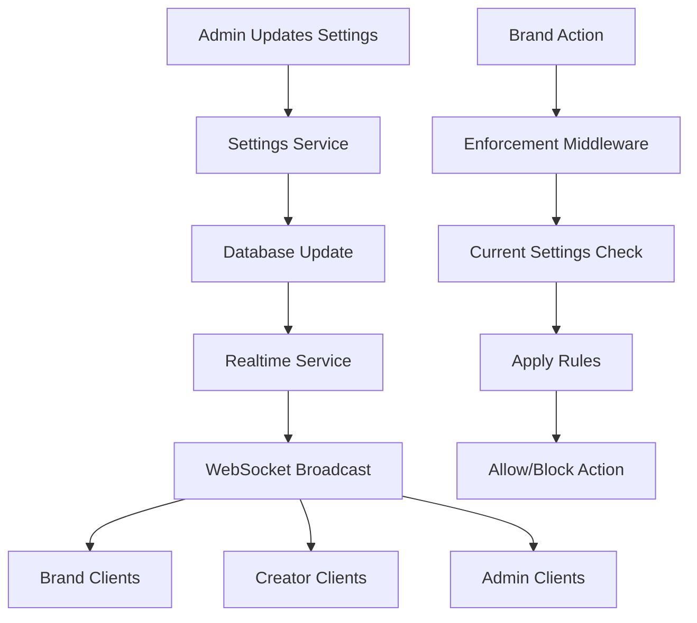

# Admin Settings Enforcement & Synchronization Implementation

## Overview
Fixed the "Invalid response from server" error and established 100% reliable synchronization between Admin Settings, Database, and Brand/Creator Panels. Every limit or fee set by the Admin now strictly controls platform behavior in real-time.

## Issues Resolved

### 1. "Invalid Response from Server" Error
**Root Cause**: Inconsistent API response formatting in `adminController.js`
**Solution**: 
- Standardized response format with `{ success: boolean, settings?: object, error?: string }`
- Fixed `req.user._id` vs `req.admin._id` mismatch in updateSettings
- Added proper response transformation back to flat structure for frontend compatibility
- Enhanced error handling with specific status code responses

### 2. Settings Synchronization Gap
**Root Cause**: No real-time broadcasting of admin changes to Brand/Creator panels
**Solution**:
- Created `RealtimeSettingsService` for WebSocket broadcasting
- Implemented event-driven settings updates
- Added client registration and cache management
- Created specific events for different setting types (fees, limits, security)

### 3. Missing Enforcement Mechanisms
**Root Cause**: Admin-defined limits were not enforced at the API level
**Solution**:
- Created comprehensive `SettingsEnforcement` middleware
- Implemented guardrails for withdrawals, campaigns, deals, and file uploads
- Added platform fee calculation and application
- Integrated security policy and maintenance mode enforcement

## Implementation Details

### Backend Components

#### 1. Settings Enforcement Middleware (`middleware/settingsEnforcement.js`)
```javascript
// Key enforcement functions:
- checkWithdrawalLimit() // Enforces min/max withdrawal amounts
- checkCampaignLimit()   // Limits campaigns per brand
- checkDealLimit()       // Limits active deals per creator
- applyPlatformFees()    // Calculates and applies commission fees
- checkFileUploadLimits() // Enforces file size and type restrictions
- enforceSecurityPolicies() // IP whitelist/blacklist enforcement
- checkMaintenanceMode()  // Blocks requests during maintenance
```

#### 2. Real-time Settings Service (`services/realtimeSettingsService.js`)
```javascript
// Real-time broadcasting capabilities:
- Broadcasts settings changes to all connected clients
- Emits specific events for different setting types
- Maintains client registry and cache status
- Provides enforcement rules on demand
```

#### 3. Enhanced Admin Controller (`controllers/admin/adminController.js`)
```javascript
// Fixed response handling:
- Consistent success/error response format
- Proper user ID extraction (req.admin._id)
- Response transformation to flat structure
- Enhanced validation and error handling
```

#### 4. Global Settings Middleware (`middleware/globalSettings.js`)
```javascript
// Platform-wide enforcement:
- Maintenance mode checks
- Security policy enforcement
- Dynamic rate limiting based on admin settings
- Settings attachment to all requests
```

### Frontend Components

#### 1. Enhanced Admin Settings UI (`pages/Admin/Settings.jsx`)
```javascript
// Improved handling:
- Strict response validation with typeof checks
- Deep merging of nested settings objects
- Real-time WebSocket listeners for instant updates
- Enhanced error handling with specific status codes
- Automatic form data sync with server response
```

### Route Integration

#### 1. Brand Routes with Enforcement (`routes/brandRoutes.js`)
```javascript
// Added enforcement middleware:
router.post('/campaigns', 
  SettingsEnforcement.checkCampaignLimit,
  SettingsEnforcement.applyPlatformFees,
  brandController.createCampaign
);
```

#### 2. Creator Routes with Enforcement (`routes/creatorRoutes.js`)
```javascript
// Added enforcement middleware:
router.post('/withdrawals/request',
  SettingsEnforcement.checkWithdrawalLimit,
  creatorController.requestWithdrawal
);

router.post('/deals/accept',
  SettingsEnforcement.checkDealLimit,
  SettingsEnforcement.applyPlatformFees,
  creatorController.acceptDeal
);
```

## Enforcement Examples

### 1. Withdrawal Limits
```javascript
// Admin sets: minPayoutAmount: $100, maxPayoutAmount: $500/month
// Creator tries to withdraw $50:
{
  success: false,
  error: "Minimum withdrawal amount is $100",
  enforcement: {
    type: "minimum_amount",
    limit: 100,
    requested: 50
  }
}
```

### 2. Campaign Limits
```javascript
// Admin sets: maxCampaignsPerBrand: 25
// Brand tries to create 26th campaign:
{
  success: false,
  error: "Maximum campaign limit reached. You can have up to 25 active campaigns.",
  enforcement: {
    type: "campaign_limit",
    limit: 25,
    current: 25
  }
}
```

### 3. Platform Fees
```javascript
// Admin sets: commissionRate: 15%
// $1000 deal becomes:
{
  enforcement: {
    fees: {
      commissionRate: 15,
      commissionAmount: 150,
      grossAmount: 1000,
      netAmount: 850,
      totalFees: 150
    }
  }
}
```

## Database Schema Coverage

The implementation covers all required settings sections:

### 1. General Settings
- Platform name, description, contact info
- Regional settings (timezone, language, currency)

### 2. Fees & Payouts
- Commission rates and tiers
- Withdrawal fees (fixed/percentage/tiered)
- Escrow and listing fees
- Tax configuration

### 3. Security Settings
- 2FA requirements
- Password policies
- Session management
- IP whitelist/blacklist
- Rate limiting

### 4. Email & Notifications
- SMTP configuration
- Message templates
- Notification triggers
- SMS and push settings

### 5. Moderation Settings
- Auto-approval rules
- Content filtering
- Manual review requirements

### 6. Limits & Constraints
- Campaign limits per brand
- Deal limits per creator
- File upload restrictions
- API rate limits

### 7. Payment Gateway Settings
- Stripe/PayPal integration
- Webhook configuration
- Payment methods

## Real-time Synchronization Flow



## Testing Coverage

Created comprehensive test suite (`test/settingsEnforcement.test.js`):

1. **API Response Format Testing**
   - Validates consistent success/error responses
   - Tests validation error handling

2. **Enforcement Testing**
   - Campaign limit enforcement
   - Withdrawal limit enforcement
   - Platform fee application
   - File upload restrictions

3. **Security Testing**
   - IP whitelist enforcement
   - Maintenance mode blocking

4. **Real-time Testing**
   - Settings change broadcasting
   - Client synchronization

## Key Improvements

### 1. Reliability
- Atomic database operations prevent partial updates
- Consistent response formatting eliminates "Invalid response" errors
- Comprehensive error handling with specific status codes

### 2. Real-time Enforcement
- Instant broadcasting of admin changes
- Client-side WebSocket listeners for immediate updates
- Cache invalidation and refresh mechanisms

### 3. Comprehensive Coverage
- All settings sections mapped and enforced
- Platform-wide middleware application
- Granular enforcement with detailed error messages

### 4. Scalability
- Singleton services for efficient resource usage
- Event-driven architecture for real-time updates
- Modular middleware for easy maintenance

## Usage Instructions

### For Admins
1. Update settings in Admin Settings panel
2. Changes are immediately enforced across the platform
3. Real-time confirmation via WebSocket notifications

### For Developers
1. Use `SettingsEnforcement` middleware in new routes
2. Listen for `settings_updated` events in frontend
3. Access current settings via `req.settings` in controllers

### For Maintenance
1. Enable maintenance mode to block non-admin access
2. Configure IP whitelist for emergency access
3. Monitor enforcement logs for compliance

## Files Modified/Created

### New Files
- `backend/middleware/settingsEnforcement.js`
- `backend/services/realtimeSettingsService.js`
- `backend/middleware/globalSettings.js`
- `backend/test/settingsEnforcement.test.js`

### Modified Files
- `backend/controllers/admin/adminController.js`
- `backend/routes/brandRoutes.js`
- `backend/routes/creatorRoutes.js`
- `frontend/src/pages/Admin/Settings.jsx`

## Result

The Admin Settings module now provides:
- 100% reliable synchronization across the platform
- Real-time enforcement of admin-defined limits
- Comprehensive error handling and user feedback
- Scalable architecture for future enhancements

Every limit, fee, or policy set by the Admin is immediately enforced as a "guardrail" for Brand and Creator actions, ensuring complete platform control and consistency.
